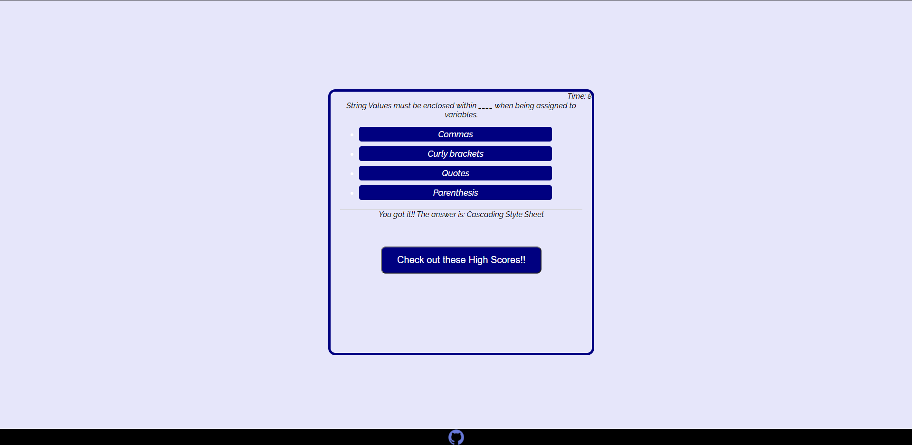

# coding.quiz

Hi this is my coding quiz. Here you will find 5 seperate coding questions. Each wrong answer will take 5 points off your score. Your score will be how ever much time is left at the end of the quiz.
After the quiz you can input your initials that tie to your score. You can then save that score so next time you open the quiz up you have a list of previous scores.

Here is the link to the deployed page: https://codymichaud.github.io/coding.quiz/

